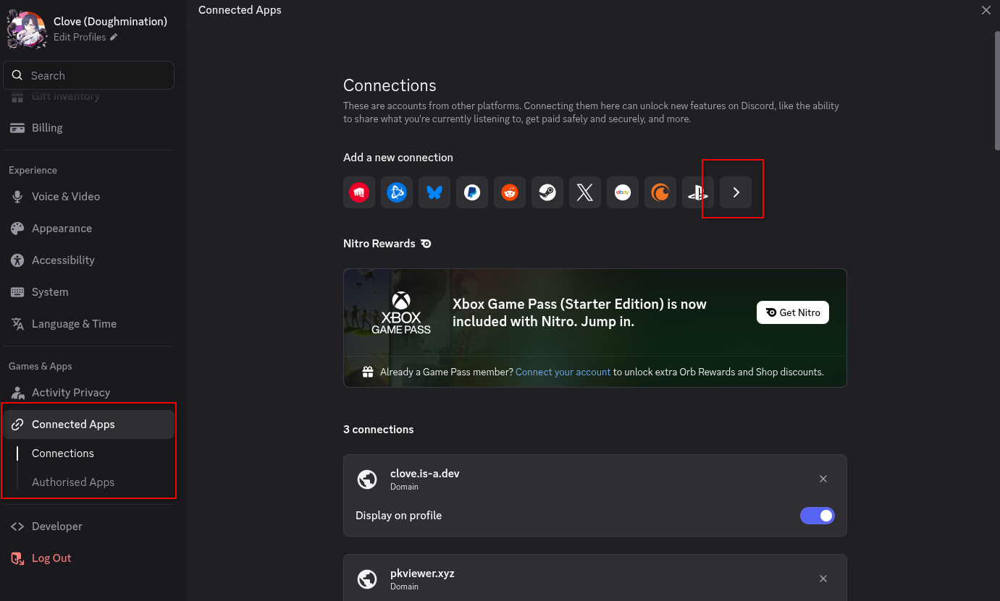
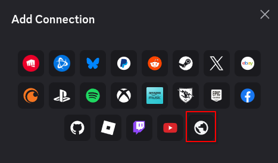
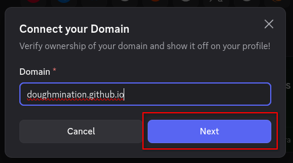
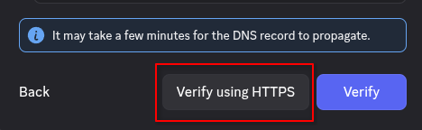
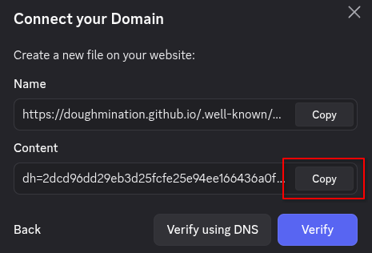
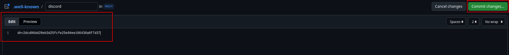
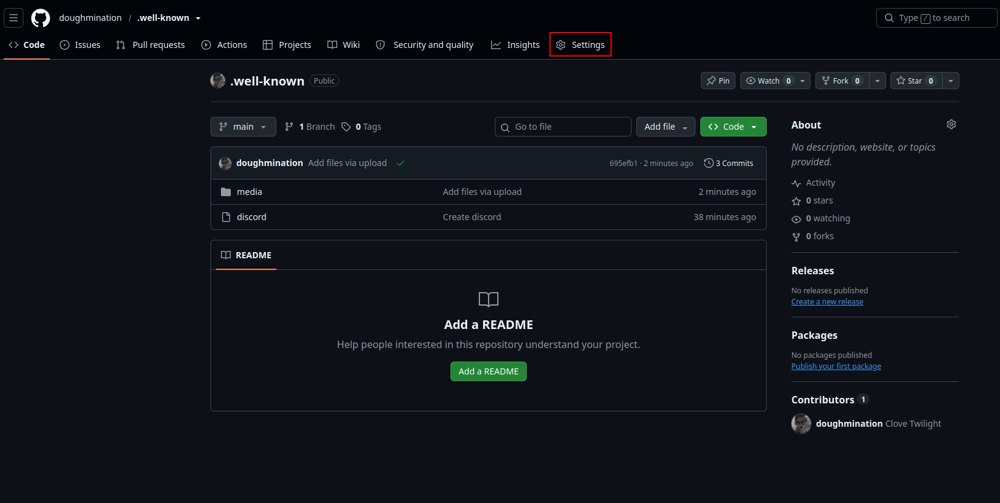
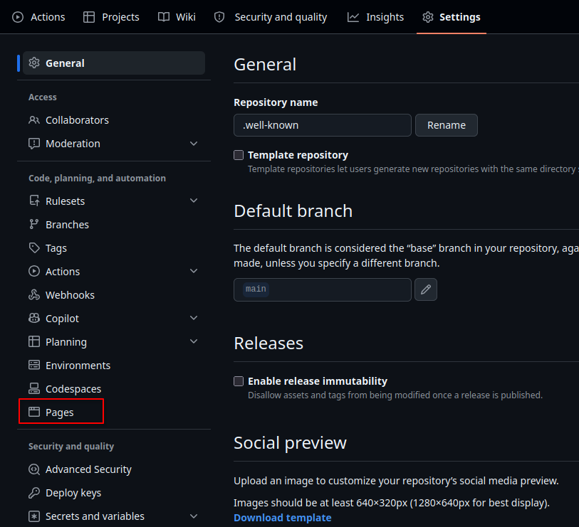
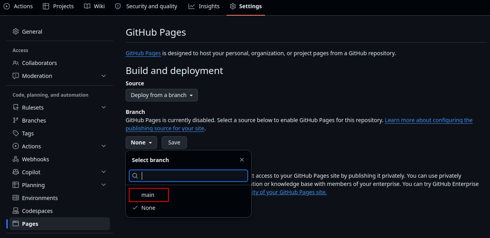
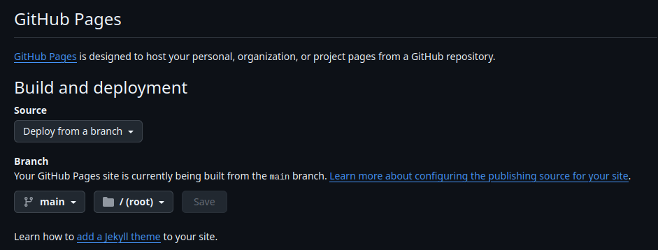

# Linking Discord and GitHub

GitHub pages is hard to link to Discord, however, this was a reasonably easy way to get a `[username].github.io` domain on your Discord's Domain Connections

## Issues

I tried to make this as idiot proof as possible, if you face issues, please let me know via this repo's `Issues` tab, my Discord or Matrix (links on my main profile) and I'll try to help

## Setup
1) You need to fork this repo, by pressing the button below or pressing "Fork" at the top of this page.

2) Open you Discord Settings, and follow these steps:
    - Open your connections and expand them out (this is at the very bottom of your settings!)
    
      

    - Press the globe, which represents the domain

      

    - Enter your domain as `your-github-username`.github.io (In my case, as my GitHub username is `doughmination`, my domain would be doughmination.github.io)

      

    - Change the method from DNS to HTTPS by pressing this button

      

    - Copy the "Contents" string

      

3) Back on GitHub, open the [discord](./discord) file, and edit it with the text you just copied, and click "Commit Changes"

   

4) Deploy to GitHub Pages via these steps:
   - Click `Settings` on the very far top right
  
     

   - Open up the `Pages` part of the settings

     

   - Where it says `Branch`, change this from `None` to `main`

     

   - Click Save, and once it's saved, give it between 15-20 minutes, then repeat step 2. This time, it should automatically link, and not ask for any settings
  
     
